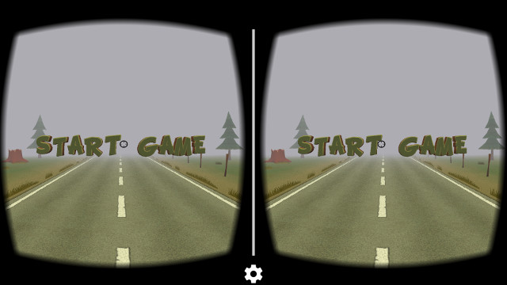
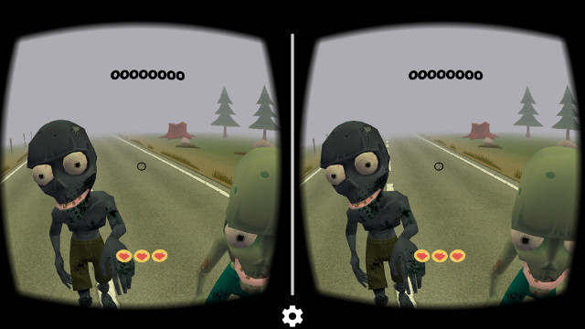
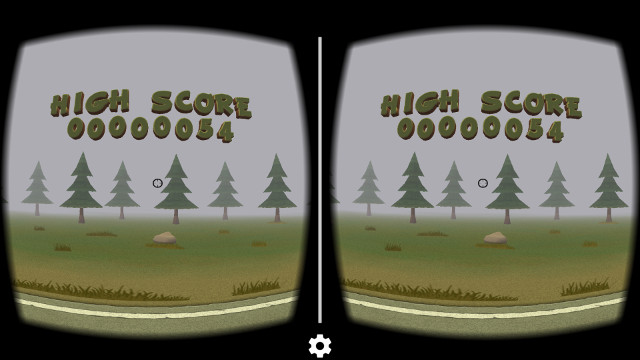

# ZombieInvadersVR
A Virtual Reality Game using Google Cardboard and libGDX.
This game is basically a final work to my graduate studies (Brazil Pós Graduação).

# System Requirements
* Android Smartphone/Cellphone
* Gyroscope Sensor (in your Smartphone)

# Using
* Google Cardboard - https://vr.google.com/cardboard/
* libGDX - https://github.com/libgdx/libgdx
* Wei Yang - https://github.com/yangweigbh/Libgdx-CardBoard-Extension
